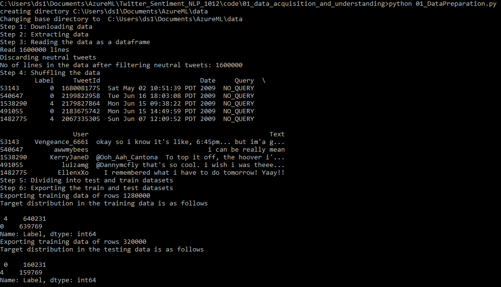
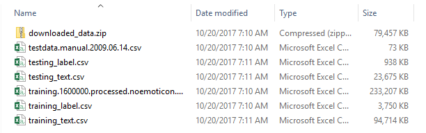
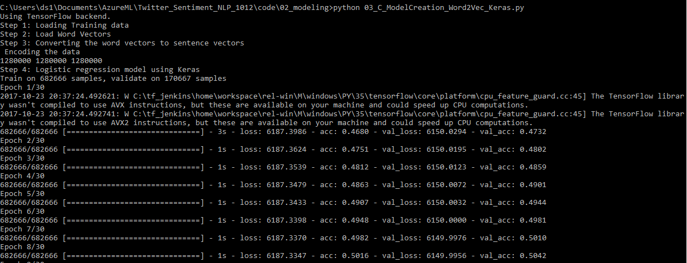

# Use word embedding to predict Twitter sentiment

## Introduction

In this tutorial we are going to demonstrate the usage of Word Embedding algorithms like **Word2Vec** algorithm and **Sentiment Specfic Word Embedding (SSWE) Algorithm** to predict Twitter sentiment in Azure Machine Learning Workbench.

For more information about Word2Vec and SSWE, you can refer to those papers: [Mikolov, Tomas, et al. Distributed representations of words and phrases and their compositionality. Advances in neural information processing systems. 2013.](https://arxiv.org/abs/1310.4546) and **Sentiment Specfic Word Embedding (SSWE) Algorithm** [Tang, Duyu, et al. "Learning Sentiment-Specific Word Embedding for Twitter Sentiment Classification." ACL (1). 2014.](http://www.aclweb.org/anthology/P14-1146) 

## Content
This tutorial consists of the following three main parts with each part consisting of one or more python scripts.

1. [Data Preparation](http://aka.ms/) 
2. [Modeling](https://aka.ms/) 
    1. Feature Engineering
    2. Model Creation
    3. Model Evaluation 
3. [Deployment](http://aka.ms/) 

## Step-by-Step walkthrough

### Data Preparation
The first step in this tutorial is to download the sentiment140 dataset and divide it into train and test datasets. This part of the tutorial performs the downloading of the data and the splitting of data into train and test datasets. Execute 01_DownloadData.py in Azure ML Workbench Command Line to prepare the training and testing data. Remember to change the path of where the data set will be located.

After this step is finished, several CSV files are generated in your specified data directory.

### Modeling
This part of the tutorial is further divided into three subparts. **Feature Engineering** corresponds to the generation of features using different word embedding algorithms. **Model Creation** deals with the training of different models like _logistic regression_ and _gradient boosting_ to predict sentiment of the input text. **Model Evaluation** applies the trained model over the testing data.

#### Feature Engineering
We use Word2Vec and SSWE to generate word embeddings. Modify the training file path in the scripts and run [02_A_Word2Vec.py](../02_modeling/02_A_Word2Vec.py) and [02_B_SSWE_Keras_w_CNTK.py](../02_modeling/02_B_SSWE_Keras_w_CNTK.py) in Azure ML Workbench CLI. 

First we train Word2Vec model to get the embedding, as the training process proceeds, the average loss is decreasing. After 100000 iterations, the loss is stable and training process is paused. Final embedding file has 304416 vocabularies, each of which has a embedding vector of size 50.

Then we train SSWE embedding model. 

After the training process is done, two embedding files in the format of TSV are generated in the vectors folder under 02_modeling.

#### Model Creation

We apply the two types of features: Word2Vec and SSWE into two models: GBM model and Logistic regression model. Therefore we have four models to compare.

* Word2Vec in GBM model

* Word2Vec in Logistic model

* SSWE in GBM model

* SSWE in Logistic model

#### Model Evaluation
We use the trained 4 models in tetsting data to get compare the model's performance, GBM model with SSWE features is the best one in terms of AUC value.

### Deployment
This part of the tutorial demonstrates how to use Azure container services to deploy pre-trained sentiment prediction models.
