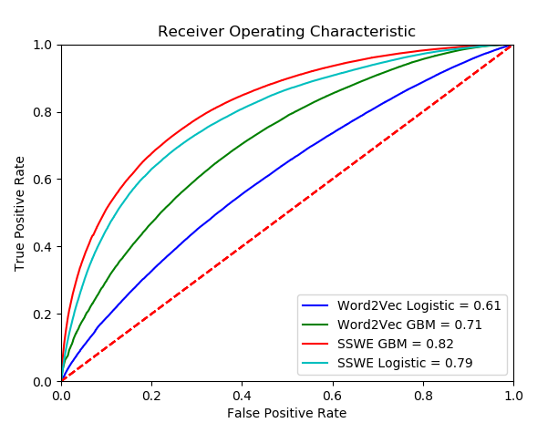

# Use word embeddings to predict Twitter sentiment following Team Data Science Process

### [Use word embeddings to predict Twitter sentiment following Team Data Science Process](https://docs.microsoft.com/azure/machine-learning/preview/scenario-tdsp-twitter-sentiment)

The primary purpose of this tutorial is to show how to instantiate and execute a machine learning project using the Team Data Science Process (TDSP) structure and templates in Azure Machine Learning Work Bench. For this purpose, we use [Twitter Sentiment data](http://cs.stanford.edu/people/alecmgo/trainingandtestdata.zip). The modeling task is to predict sentiment polarity (positive or negative) using the text from tweets.

In this walkthrough, we demonstrate the usage of Word Embedding algorithms like Word2Vec algorithm and Sentiment Specfic Word Embedding (SSWE) Algorithm to predict Twitter sentiment in Azure Machine Learning Workbench. The trained model is deployed to a web service using Azure Container Service(ACS). We are following Team Data Science Process to execute this project.

This walkthrough is executed using TDSP templates which consist of the following parts: 

- [Data acquisition and understanding](https://github.com/Azure/MachineLearningSamples-TwitterSentimentPrediction/tree/master/code/01_data_acquisition_and_understanding)

- [Modeling](https://github.com/Azure/MachineLearningSamples-TwitterSentimentPrediction/tree/master/code/02_modeling)
    - Feature Engineering
    - Model Creation
    - Model Evaluation

    <table class="image" align="center">
    <caption align="bottom">Skip-gram model</caption>
    <tr><td></td></tr>
    </table>

    SSWE inspired neural network model that we use in this tutorial is shown in the following figure
    <table class="image" align="center">
    <caption align="bottom">Convolutional model to generate sentiment specific word embedding</caption>
    <tr><td></td></tr>
    </table>

     

- [Deployment](https://github.com/Azure/MachineLearningSamples-TwitterSentimentPrediction/tree/master/code/03_deployment)

Some highlights from this tutorial:
- This tutorial is running on the latest Azure Machine Learning Work Bench
- Model training is performed in Azure DSVM with GPU 
- We created word embedding using Word2Vec and SSWE
- Deep learning frameworks and packages such as TensorFlow, CNTK and Keras are applied in this project
- We compared four models that use different word embedding methods and modeling techniques
- The trained model is deployed to a web service using Azure Container Service (ACS).

For more details, please visit this step by step [walkthrough](https://github.com/Azure/MachineLearningSamples-TwitterSentimentPrediction/blob/master/docs/deliverable_docs/Step_By_Step_Tutorial.md) in GitHub repository.

We would love to hear your feedback on how TDSP can be further enhanced for your evolving needs in this space – you can send us your feedback and comments via the GitHub [issues page](https://github.com/Azure/MachineLearningSamples-TwitterSentimentPrediction/issues).
