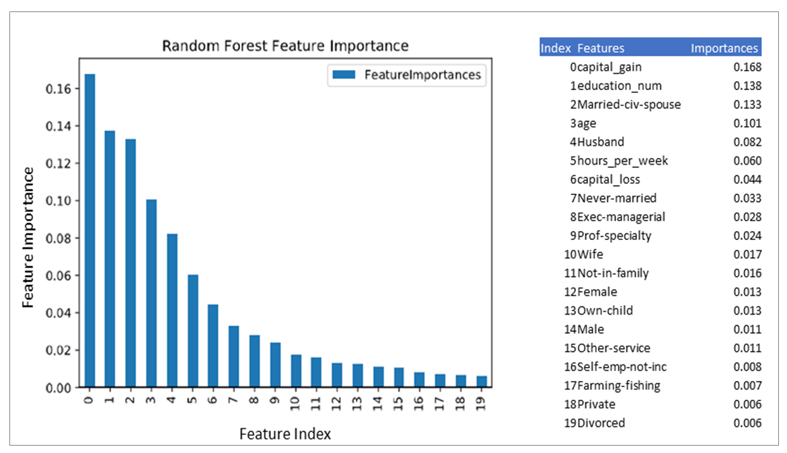
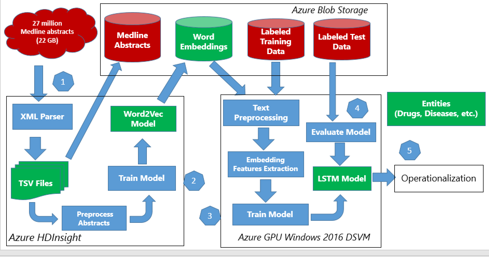

# The Microsoft Team Data Science Process (TDSP) – Recent Updates

2017-12-15

This post is authored by Wei Guo, Data Scientist, Xibin Gao, Data Scientist, Brad Severtson, Senior Content Developer, and Debraj GuhaThakurta, Senior Data Scientist Lead, at Microsoft.

## What is TDSP
Improving the efficiency of developing and deploying data science solutions requires an efficient process to complement the data platforms and data science tools that you use. Many enterprise data science teams today face challenges pertaining to standardization, collaboration and the use of appropriate DevOps practices when developing and deploying their advanced analytics solutions.

We developed and released the [Team Data Science Process (TDSP)](https://docs.microsoft.com/en-us/azure/machine-learning/team-data-science-process/overview), an open GitHub project, to address these very challenges. TDSP is currently helping numerous data science teams in Microsoft and at other organizations to standardize their data science projects, adopt collaborative development and DevOps practices. TDSP was [first released at Ignite in September 2016](https://blogs.technet.microsoft.com/machinelearning/2016/10/11/introducing-the-team-data-science-process-from-microsoft/).

In this blog post, we provide an overview of recent developments involving TDSP, including recent releases and how its adoption has gone since our first public release.

## **Recent Releases**

After the [instantiation the TDSP Template in Azure Machine Learning](https://docs.microsoft.com/en-us/azure/machine-learning/preview/how-to-use-tdsp-in-azure-ml) has been enabled, three walkthroughs using TDSP templates have been released. Those walkthroughs demonstrated how to execute data science projects following TDSP in Azure Machine Learning Work Bench.

### [Income classification with Team Data Science Process (TDSP) project](https://docs.microsoft.com/en-us/azure/machine-learning/preview/scenario-tdsp-classifying-us-incomes?toc=%2Fen-us%2Fazure%2Fmachine-learning%2Fteam-data-science-process%2Ftoc.json&bc=%2Fen-us%2Fazure%2Fbread%2Ftoc.json)

The primary purpose of this sample is to show how to instantiate and execute a machine learning project using the Team Data Science Process (TDSP) structure and templates in Azure Machine Learning. For this purpose, we use the well-known 1994 US Census data from the UCI Machine Learning Repository. The modeling task is to predict US annual income classes from US Census information (for example, age, race, education level, country of origin, etc.)

### [Use word embeddings to predict Twitter sentiment following Team Data Science Process](https://docs.microsoft.com/azure/machine-learning/preview/scenario-tdsp-twitter-sentiment)

In this walkthrough, we demonstrate the usage of Word Embedding algorithms like Word2Vec algorithm and Sentiment Specfic Word Embedding (SSWE) Algorithm to predict Twitter sentiment in Azure Machine Learning Workbench. The trained model is deployed to a web service using Azure Container Service(ACS). We are following Team Data Science Process to execute this project.

### [Biomedical entity recognition using Team Data Science Process (TDSP) Template](https://docs.microsoft.com/en-us/azure/machine-learning/preview/scenario-tdsp-biomedical-recognition?toc=%2Fen-us%2Fazure%2Fmachine-learning%2Fteam-data-science-process%2Ftoc.json&bc=%2Fen-us%2Fazure%2Fbread%2Ftoc.json)

The aim of this real-world scenario is to highlight how to use Azure Machine Learning Workbench to solve a complicated Natural Language Processing (NLP) task such as entity extraction from unstructured text. The model is trained to extract the mentions of named entities such diseases, drugs, chemicals and symptoms from electronic medical or health records.

We would love to hear your feedback on how TDSP can be further enhanced for your evolving needs in this space – you can send us your feedback and comments via the GitHub [issues page](https://github.com/Azure/Microsoft-TDSP/issues) for TDSP or in the comments section below.

Wei, Xibin, Brad and Debraj