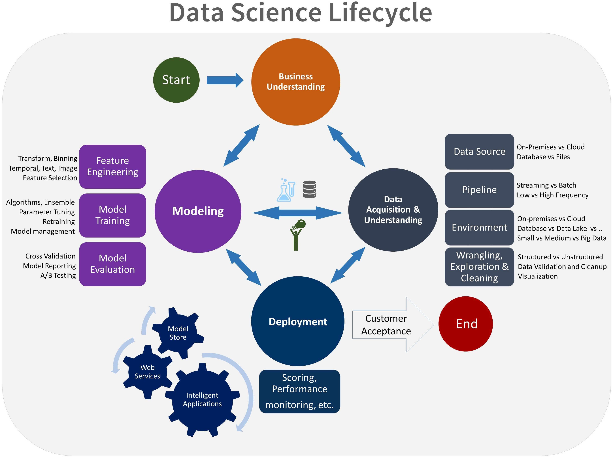
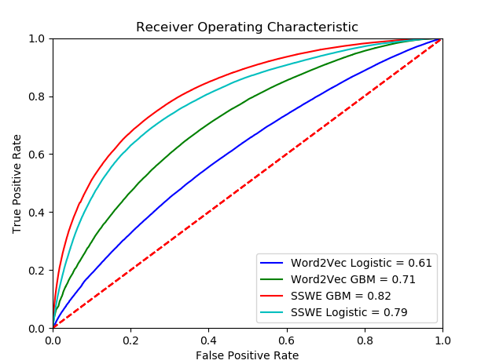

# Use word embeddings to predict Twitter sentiment following Team Data Science Process

## Introduction
Standardization of the structure and documentation of data science projects, that is anchored to an established [data science lifecycle](https://github.com/Azure/Microsoft-TDSP/blob/master/Docs/lifecycle-detail.md), is key to facilitating effective collaboration in data science teams. Creating Azure Machine Learning projects with the [Team Data Science Process (TDSP)](https://github.com/Azure/Microsoft-TDSP) template provides a framework for such standardization.

We had previously released a [GitHub repository for the TDSP project structure and templates](https://github.com/Azure/Azure-TDSP-ProjectTemplate). We have now enabled creation of Azure Machine Learning projects that are instantiated with [TDSP structure and documentation templates for Azure Machine Learning](https://github.com/amlsamples/tdsp). Instructions on how to use TDSP structure and templates in Azure Machine Learning is provided [here](https://docs.microsoft.com/en-us/azure/machine-learning/preview/how-to-use-tdsp-in-azure-ml). 

In this tutorial we are going to demonstrate the usage of Word Embedding algorithms like **Word2Vec** algorithm and **Sentiment Specfic Word Embedding (SSWE) Algorithm** to predict Twitter sentiment in Azure Machine Learning Workbench. We will follow [Team Data Science Process](https://docs.microsoft.com/en-us/azure/machine-learning/team-data-science-process/overview) to execute this project.

## Link to GitHub repository
We provided a step by step [walkthrough](https://github.com/Azure/MachineLearningSamples-TwitterSentimentPrediction/blob/master/docs/deliverable_docs/Step_By_Step_Tutorial.md) in GitHub repository.

### Purpose
The primary purpose of this tutorial is to show how to instantiate and execute a machine learning project using the Team Data Science Process (TDSP) structure and templates in Azure Machine Learning Work Bench. For this purpose, we use [Twitter Sentiment data](http://cs.stanford.edu/people/alecmgo/trainingandtestdata.zip). The modeling task is to predict sentiment polarity (positive or negative) using the text from tweets.

### Scope
- Data exploration, training, and deployment of a machine learning model which address the prediction problem described in the Use Case Overview.
- Execution of the project in Azure Machine Learning using the Team Data Science Process (TDSP) template from Azure Machine Learning for this project. For project execution and reporting, we're going to use the TDSP lifecycle.
- Operationalization of the solution directly from Azure Machine Learning in Azure Container Services.

The project highlights several features of Azure Machine Learning, such TDSP structure instantiation and use, execution of code in Azure Machine Learning Work Bench, and easy operationalization in Azure Container Services using Docker and Kubernetes.

## Team Data Science Process

We use the TDSP project structure and documentation templates to execute this tutorial. It follows the [TDSP lifecycle]((https://github.com/Azure/Microsoft-TDSP/blob/master/Docs/lifecycle-detail.md)). The project is created based on the instructions provided [here](https://github.com/amlsamples/tdsp/blob/master/docs/how-to-use-tdsp-in-azure-ml.md).

 

## Use case overview
The task is to predict each twitter's sentiment binary polarity using word embeddings features extracted from twitter text. For detailed descripton, please refer to this [repository](https://github.com/Azure/MachineLearningSamples-TwitterSentimentPrediction).

### [Data acquisition and understanding](https://github.com/Azure/MachineLearningSamples-TwitterSentimentPrediction/tree/master/code/01_data_acquisition_and_understanding)
The first step in this tutorial is to download the sentiment140 dataset and divide it into train and test datasets.

Sentiment140 dataset contains the actual content of the tweet (with emoticons removed) along with the polarity of each of the tweet (negative=0, positive=4) as well, with neutral tweets removed. The resulting training data has 1.3 millow rows and testing data has 320k rows.

### [Modeling](https://github.com/Azure/MachineLearningSamples-TwitterSentimentPrediction/tree/master/code/02_modeling)
This part of the tutorial is further divided into three subparts: 
- **Feature Engineering** corresponds to the generation of features using different word embedding algorithms. 
- **Model Creation** deals with the training of different models like _logistic regression_ and _gradient boosting_ to predict sentiment of the input text. 
- **Model Evaluation** applies the trained model over the testing data.

#### [Feature Engineering](https://github.com/Azure/MachineLearningSamples-TwitterSentimentPrediction/tree/master/code/02_modeling/01_FeatureEngineering)
We use Word2Vec and SSWE to generate word embeddings. 

##### Word2Vec
First we use the Word2Vec algorithm in the Skipgram mode as explained in the paper [Mikolov, Tomas, et al. Distributed representations of words and phrases and their compositionality. Advances in neural information processing systems. 2013.](https://arxiv.org/abs/1310.4546) to generate word embeddings.

Skip-gram is a shallow neural network taking the target word encoded as a one hot vector as input and using it to predict nearby words. If _V_ is the size of the vocabulary then the size of the output layer would be __C*V__ where C is the size of the context window. The skip-gram based architecture is shown in the following figure.
 
<table class="image" align="center">
<caption align="bottom">Skip-gram model</caption>
<tr><td></td></tr>
</table>

The details of the word2vec algorithm and skip-gram model are beyond the scope of this tutorial and the interested readers are requested to go through the following links for more details. The code 02_A_Word2Vec.py referenced [tensorflow examples](https://github.com/tensorflow/tensorflow/blob/master/tensorflow/examples/tutorials/word2vec/word2vec_basic.py)

* [Vector Representation of Words](https://www.tensorflow.org/tutorials/word2vec)
* [How exactly does word2vec work?](http://www.1-4-5.net/~dmm/ml/how_does_word2vec_work.pdf)
* [Notes on Noise Contrastive Estimation and Negative Sampling](http://demo.clab.cs.cmu.edu/cdyer/nce_notes.pdf)

##### SSWE
**Sentiment Specfic Word Embedding (SSWE) Algorithm** proposed in [Tang, Duyu, et al. "Learning Sentiment-Specific Word Embedding for Twitter Sentiment Classification." ACL (1). 2014.](http://www.aclweb.org/anthology/P14-1146)  tries to overcome the weakness of Word2vec algorithm that the words with similar contexts and opposite polarity can have similar word vectors. This means that Word2vec may not perform very accurately for the tasks like sentiment analysis. SSWE algorithm tries to handle this weakness by incorporating both the sentence polarity and the word's context in to its loss function.

We are using a variant of SSWE in this tutorial. SSWE uses both the original ngram and corrupted ngram as input and it uses a ranking style hinge loss function for both the syntactic loss and the semantic loss. Ultimate loss function is the weighted combination of both the syntactic loss and semantic loss. For the purpose of simplicity, we are using only the semantic cross entropy as the loss function. As we are going to see later on, even with this simpler loss function the performance of the SSWE embedding is better than the Word2Vec embedding.

SSWE inspired neural network model that we use in this tutorial is shown in the following figure
<table class="image" align="center">
<caption align="bottom">Convolutional model to generate sentiment specific word embedding</caption>
<tr><td></td></tr>
</table>

After the training process is done, two embedding files in the format of TSV are generated for the modeling stage.

For more information about Word2Vec and SSWE, you can refer to those papers: [Mikolov, Tomas, et al. Distributed representations of words and phrases and their compositionality. Advances in neural information processing systems. 2013.](https://arxiv.org/abs/1310.4546) and **Sentiment Specfic Word Embedding (SSWE) Algorithm** [Tang, Duyu, et al. "Learning Sentiment-Specific Word Embedding for Twitter Sentiment Classification." ACL (1). 2014.](http://www.aclweb.org/anthology/P14-1146) 

#### [Model Creation](https://github.com/Azure/MachineLearningSamples-TwitterSentimentPrediction/tree/master/code/02_modeling/02_ModelCreation)
Once the word vectors have been generated using either of the SSWE or Word2vec algorithm, the next step is to train the classification models to predict actual sentiment polarity. We apply the two types of features: Word2Vec and SSWE into two models: GBM model and Logistic regression model. Therefore we have four models trained.

#### [Model Evaluation](https://github.com/Azure/MachineLearningSamples-TwitterSentimentPrediction/tree/master/code/02_modeling/03_ModelEvaluation)
We use the 4 trained in previous step in tetsting data to get evaluate the model's performance, GBM model with SSWE features is the best one in terms of AUC value.

1. Gradient Boosting over SSWE embedding
2. Logistic Regression over SSWE embedding
3. Gradient Boosting over Word2Vec embedding
4. Logistic Regression over Word2Vec embedding

### [Deployment](https://github.com/Azure/MachineLearningSamples-TwitterSentimentPrediction/tree/master/code/03_deployment)
This part we will deploy pre-trained sentiment prediction model (SSWE embedding + GBM model) to a web service on a cluster in the Azure Container Service (ACS). The operationalization environment provisions Docker and Kubernetes in the cluster to manage the web-service deployment. You can find further information on the operationalization process [here](https://docs.microsoft.com/en-us/azure/machine-learning/preview/model-management-service-deploy).

## Conclusion
We went through the details on how to train a word embedding model using Word2Vec and SSWE algorithms and then use the extracted embeddings as features to train several models to predict the sentiment score of Twitter text data. Sentiment Specific Wording Embeddings(SSWE) feature with Gradient Boosted Tree model gives the best performance. In the end this model is deployed as a real time web service in Azure Container Services with the help of Azure Machine Learning Work Bench.

## References
* [Team Data Science Process](https://docs.microsoft.com/en-us/azure/machine-learning/team-data-science-process/overview) 
* [How to use Team Data Science Process (TDSP) in Azure Machine Learning](https://aka.ms/how-to-use-tdsp-in-aml)
* [TDSP project template for Azure Machine Learning](https://aka.ms/tdspamlgithubrepo)
* [Azure ML Work Bench](https://docs.microsoft.com/en-us/azure/machine-learning/preview/)
* [US Income data-set from UCI ML repository](https://archive.ics.uci.edu/ml/datasets/adult)
* [Biomedical Entity Recognition using TDSP Template](https://docs.microsoft.com/en-us/azure/machine-learning/preview/scenario-tdsp-biomedical-recognition)
* [Mikolov, Tomas, et al. Distributed representations of words and phrases and their compositionality. Advances in neural information processing systems. 2013.](https://arxiv.org/abs/1310.4546)
* [Tang, Duyu, et al. "Learning Sentiment-Specific Word Embedding for Twitter Sentiment Classification." ACL (1). 2014.](http://www.aclweb.org/anthology/P14-1146)