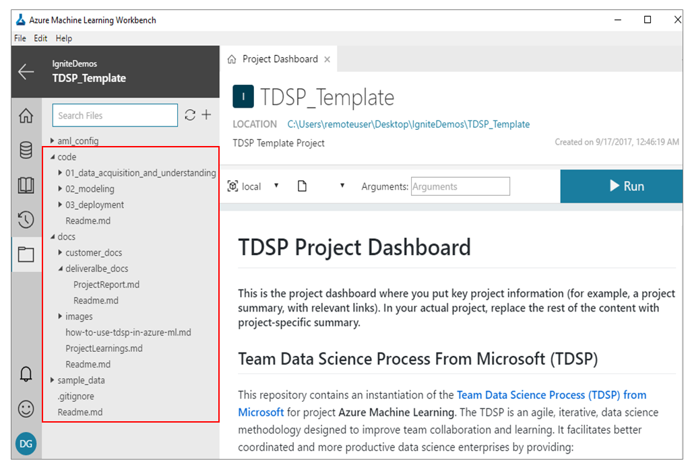
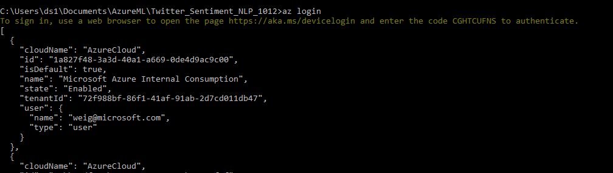

# Use word embeddings to predict Twitter sentiment following Team Data Science Process

## Introduction
In this tutorial we are going to demonstrate the usage of Word Embedding algorithms like **Word2Vec** algorithm and **Sentiment Specfic Word Embedding (SSWE) Algorithm** to predict Twitter sentiment in Azure Machine Learning Workbench. We will follow [Team Data Science Process](https://docs.microsoft.com/en-us/azure/machine-learning/team-data-science-process/overview) to execute this project.

## Team Data Science Process

We use the TDSP project structure and documentation templates to execute this tutorial. It follows the [TDSP lifecycle]((https://github.com/Azure/Microsoft-TDSP/blob/master/Docs/lifecycle-detail.md)). The project is created based on the instructions provided [here](https://github.com/amlsamples/tdsp/blob/master/docs/how-to-use-tdsp-in-azure-ml.md).

 

## Content
This tutorial consists of the following three main parts with each part consisting of one or more python scripts.
1. [Data acquisition and understanding](#data-acquisition-and-understanding)
2. [Modeling](#modeling)
    * [Feature Engineering](#feature-engineering)
    * [Model Creation](#model-creation)
    * [Model Evaluation](#model-evaluation) 
3. [Deployment](#deployment)

## Step-by-Step walkthrough

### Pre-requisite
Before diving into the project, some pre-requisites have to be met

- An Azure [subscription](https://azure.microsoft.com/en-us/free/)
- Azure Machine Learning Workbench with a workspace created. See [installation guide](quick-start-installation.md). 
- [Install Azure ML Work Bench](https://docs.microsoft.com/en-us/azure/machine-learning/preview/)
- You can run through the tutorial locally on a [Data Science Virtual Machine (DSVM)](https://docs.microsoft.com/en-us/azure/machine-learning/machine-learning-data-science-linux-dsvm-intro).
- To provision DSVM for Windows 2016, follow the instructions [here](https://docs.microsoft.com/en-us/azure/machine-learning/machine-learning-data-science-provision-vm). We recommend using [NC6 Standard (56 GB, K80 NVIDIA Tesla)](https://docs.microsoft.com/en-us/azure/machine-learning/machine-learning-data-science-linux-dsvm-intro).

- Install some required packages
    * [Tensorflow](https://www.tensorflow.org/install/)
    * [CNTK](https://docs.microsoft.com/en-us/cognitive-toolkit/setup-cntk-on-your-machine)
    * [nltk](http://www.nltk.org/install.html)
    * [num2words](https://pypi.python.org/pypi/num2words)
    * [Keras](https://keras.io/#installation)
    * [pydot](https://pypi.python.org/pypi/pydot)
    * [h5py](http://www.h5py.org/)

### Project Creation 
First we need to clone this tutorial to your local machine by running the following command: 

    git clone https://github.com/Azure/MachineLearningSamples-TwitterSentimentPrediction.git

   

Start Azure ML WorkBench, create a new project and choose blank project template

   
   

Copy the cloned files (except .git file) to your project folder, overwrite the existing files in the project folder. 

    

There are two ways to run the script: you can run each .py file within the UI of Azure ML WorkBench by clicking the run button, or you can run the .py file directly in Azure Machine Learning Command Line (CLI).

* To run the .py script in CLI, open the Command line window from **File** in the upper left corner of Azure ML Work Bench Work Bench window, and then in the command line use **python path-to-python code** to execute the code.

    

    

The screenshots below demonstrate running the tutorial in CLI, running it in Jupyter Notebook is similar.

### Data acquisition and understanding
The first step in this tutorial is to download the sentiment140 dataset and divide it into train and test datasets. This part of the tutorial performs the downloading of the data and the splitting of data into train and test datasets. Execute 01_DownloadData.py in Azure ML Workbench Command Line to prepare the training and testing data. Remember to change the path of where the data set will be located. 

Sentiment140 dataset contains the actual content of the tweet (with emoticons removed) along with the polarity of each of the tweet (negative=0, neutral =2, positive=4) as well. Sentiment140 dataset has been labelled using the concept of distant supervision as explained in the paper **[Twitter Sentiment Classification Using Distant Supervision](http://cs.stanford.edu/people/alecmgo/papers/TwitterDistantSupervision09.pdf)**

Though the sentiment 140 dataset is internally divided into train and test subsets, the size of the test dataset is very small as compared to the train dataset. So, we are randomly split the training data into training and testing datasets.

After this step is finished, several CSV files are generated in your specified data directory.

### Modeling
This part of the tutorial is further divided into three subparts: 
- **Feature Engineering** corresponds to the generation of features using different word embedding algorithms. 
- **Model Creation** deals with the training of different models like _logistic regression_ and _gradient boosting_ to predict sentiment of the input text. 
- **Model Evaluation** applies the trained model over the testing data.

#### Feature Engineering
We use Word2Vec and SSWE to generate word embeddings. 

##### Word2Vec
First we use the Word2Vec algorithm in the Skipgram mode as explained in the paper [Mikolov, Tomas, et al. Distributed representations of words and phrases and their compositionality. Advances in neural information processing systems. 2013.](https://arxiv.org/abs/1310.4546) to generate word embeddings.

Skip-gram is a shallow neural network taking the target word encoded as a one hot vector as input and using it to predict nearby words. If _V_ is the size of the vocabulary then the size of the output layer would be __C*V__ where C is the size of the context window. The skip-gram based architecture is shown in the following figure.
 
<table class="image" align="center">
<caption align="bottom">Skip-gram model</caption>
<tr><td></td></tr>
</table>

The details of the word2vec algorithm and skip-gram model are beyond the scope of this tutorial and the interested readers are requested to go through the following links for more details. The code 02_A_Word2Vec.py referenced [tensorflow examples](https://github.com/tensorflow/tensorflow/blob/master/tensorflow/examples/tutorials/word2vec/word2vec_basic.py)

* [Vector Representation of Words](https://www.tensorflow.org/tutorials/word2vec)
* [How exactly does word2vec work?](http://www.1-4-5.net/~dmm/ml/how_does_word2vec_work.pdf)
* [Notes on Noise Contrastive Estimation and Negative Sampling](http://demo.clab.cs.cmu.edu/cdyer/nce_notes.pdf)

##### SSWE
**Sentiment Specfic Word Embedding (SSWE) Algorithm** proposed in [Tang, Duyu, et al. "Learning Sentiment-Specific Word Embedding for Twitter Sentiment Classification." ACL (1). 2014.](http://www.aclweb.org/anthology/P14-1146)  tries to overcome the weakness of Word2vec algorithm that the words with similar contexts and opposite polarity can have similar word vectors. This means that Word2vec may not perform very accurately for the tasks like sentiment analysis. SSWE algorithm tries to handle this weakness by incorporating both the sentence polarity and the word's context in to its loss function.

We are using a variant of SSWE in this tutorial. SSWE uses both the original ngram and corrupted ngram as input and it uses a ranking style hinge loss function for both the syntactic loss and the semantic loss. Ultimate loss function is the weighted combination of both the syntactic loss and semantic loss. For the purpose of simplicity, we are using only the semantic cross entropy as the loss function. As we are going to see later on, even with this simpler loss function the performance of the SSWE embedding is better than the Word2Vec embedding.

SSWE inspired neural network model that we use in this tutorial is shown in the following figure
<table class="image" align="center">
<caption align="bottom">Convolutional model to generate sentiment specific word embedding</caption>
<tr><td></td></tr>
</table>

Modify the training file path in the scripts and run [02_A_Word2Vec.py](../02_modeling/02_A_Word2Vec.py) and [02_B_SSWE_Keras_w_CNTK.py](../02_modeling/02_B_SSWE_Keras_w_CNTK.py) in Azure ML Workbench CLI. 

First we train Word2Vec model to get the embedding, as the training process proceeds, the average loss is decreasing. After 100000 iterations, the loss is stable and training process is paused. Final embedding file has 304416 vocabularies, each of which has a embedding vector of size 50, you may try other lengths too, but remember to change the size of embedding vector correspondingly in later steps. Please note that embedding vector with larger length may need quite a mount of time to be generated, or it might be broken due to not fitting into your machine's memory.

When the code is running, if you run **nvidia-smi** in Azure ML CLI, you can see the CPU is being utilized in the background.

Then we train SSWE embedding model. 

After the training process is done, two embedding files in the format of TSV are generated in the vectors folder under 02_modeling.

For more information about Word2Vec and SSWE, you can refer to those papers: [Mikolov, Tomas, et al. Distributed representations of words and phrases and their compositionality. Advances in neural information processing systems. 2013.](https://arxiv.org/abs/1310.4546) and **Sentiment Specfic Word Embedding (SSWE) Algorithm** [Tang, Duyu, et al. "Learning Sentiment-Specific Word Embedding for Twitter Sentiment Classification." ACL (1). 2014.](http://www.aclweb.org/anthology/P14-1146) 

#### Model Creation
Once the word vectors have been generated using either of the SSWE or Word2vec algorithm, the next step is to train the classification models to predict actual sentiment polarity. However, before the actual training of the models the word level vectors have to be converted into sentence level vectors. The sentence level vectors are generated in two steps. In the first step, vectors of all the constituent words of a sentence are stacked up to get a matrix of size __maxsequencelength*embeddingdimension__. In the next step, min max and average operations are performed on each of the column of this matrix, hence resulting into a vector of size __3__ * __embeddingdimension__ for each of the sentence. 

This vector representation of sentences is given as input to the training classifiers. For this purpose of this tutorial, we demonstrate that how these sentence vectors can be used as input by simple linear models like Logistic Regression (using a single layer neural network in Keras) or the gradient boosting model based on sklearn. We have used 3-fold cross-validation in each of the notebook to select the best model. More details can be found in the individual notebooks in the [directory](./Code/02_Modeling/02_ModelCreation).

We apply the two types of features: Word2Vec and SSWE into two models: GBM model and Logistic regression model. Therefore we have four models to compare.

* Word2Vec in GBM model

* Word2Vec in Logistic model

* SSWE in GBM model

* SSWE in Logistic model

**Run history tracking**

When you run scripts in Azure Machine Learning Work Bench, one useful feature is run history tracking which helps you monitor your experiment history runs and log the performances. 

For example, when we train the Word2Vec in GBM model, you can add a logger in your code to enable history tracking. Here we want to look at the relationship between number of estimators (how many iterations GBM runs) vesus the cross-validation score, we can add those scripts into the code. 

 

You can then in the **Arguments** window, type in the number of iterations you want GBM model to run, and click the **Run** button.

 

Then you can click the **history** icon on the left side the panel, you can check the status of all the history runs of your code.

 

Click each individual run, you can see the performance (CV score) is plotted against each of the iterations, here we have 25 iterations.

 

For more details about run history tracking, please refer to this [tutorial](https://docs.microsoft.com/en-us/azure/machine-learning/preview/how-to-use-run-history-model-metrics).

#### Model Evaluation
We use the 4 trained in previous step in tetsting data to get evaluate the model's performance, GBM model with SSWE features is the best one in terms of AUC value.

1. Gradient Boosting over SSWE embedding
2. Logistic Regression over SSWE embedding
3. Gradient Boosting over Word2Vec embedding
4. Logistic Regression over Word2Vec embedding

### Deployment
This part we will deploy pre-trained sentiment prediction model (SSWE embedding + GBM model) to a web service using Azure ML CLI. Several files are needed before deploying your model. Please move all those files under the project root directoty of Azure ML Work Bench.

* Pickled word embedding file (pickle_embeddings_SSWE_Basic_Keras_w_CNTK.tsv)
* Pre-trained model (evaluation_SSWE_GBM)
* Scoring script
* Dependency yaml
* Model input in Json format

1. Pickle word embedding by running [pickle_embedding.py](../code/03_deployment/pickle_embedding.py), the resulting pickled word embedding files start with **pickle_**.

    

2. Execute [schma_gen.py](../code/03_deployment/schema_gen.py) to create the schema required for web service, you will get a json file like this:

    

3. Log in Azure account by running **az login** in Azure Machine Learning Work Bench Command Line.Follows the instructions on screen to login to your Azure account.

    

    

    If you have multiple Azure Subscriptions, use the following command to choose one: 

        az account set -s <your subscription name>

4. Set up Web service cluster using the following commands:
            
        az ml env setup -c -n <yourclustername> --location <e.g. eastus2>

    

5. Set up Azure ML model management account(one time setup)

    az ml account modelmanagement create --location (e.g. eastus2) -n (your-new-acctname) -g (yourresourcegroupname) --sku-instances 1 --sku-name S1

    

6. Check cluster creation status using the this command, the creation may take several minutes to finish.

    az ml env show -g (yourresourcegroupname) -n (your-new-acctname)

    

7. Set deployment cluster

    az ml env set -n (yourclustername) -g (yourresourcegroupname) 

    

8. You can check Kubernetes dashboard in the local host from your browser

    

9. Create realtime web service

    az ml service create realtime --model-file (model file name) -f (scoring script name) -n (your-new-acctname) -s (web service schema json file) -r (compute environment, python or PySpark, etc) -d (dependency files)

    

10. Check the status and usage of your realtime service

    az ml service show realtime -i <yourserviceid>

     

11. Now you are ready to make prediction calls to web service 

    az ml service run realtime -i <yourserviceid> -d (web service input schema)

    

Congratulations! You have successfully deployed your model to a real time web service!

## Conclusion
We went through the details on how to train a word embedding model using Word2Vec and SSWE algorithms and then use the extracted embeddings as features to train several models to predict the sentiment score of Twitter text data. Sentiment Specific Wording Embeddings(SSWE) feature with Gradient Boosted Tree model gives the best performance. In the end this model is deployed as a real time web service in Azure Container Services with the help of Azure Machine Learning Work Bench.

## References
* [Team Data Science Process](https://docs.microsoft.com/en-us/azure/machine-learning/team-data-science-process/overview) 
* [How to use Team Data Science Process (TDSP) in Azure Machine Learning](https://aka.ms/how-to-use-tdsp-in-aml)
* [TDSP project template for Azure Machine Learning](https://aka.ms/tdspamlgithubrepo)
* [Azure ML Work Bench](https://docs.microsoft.com/en-us/azure/machine-learning/preview/)
* [US Income data-set from UCI ML repository](https://archive.ics.uci.edu/ml/datasets/adult)
* [Biomedical Entity Recognition using TDSP Template](https://docs.microsoft.com/en-us/azure/machine-learning/preview/scenario-tdsp-biomedical-recognition)
* [Mikolov, Tomas, et al. Distributed representations of words and phrases and their compositionality. Advances in neural information processing systems. 2013.](https://arxiv.org/abs/1310.4546)
* [Tang, Duyu, et al. "Learning Sentiment-Specific Word Embedding for Twitter Sentiment Classification." ACL (1). 2014.](http://www.aclweb.org/anthology/P14-1146)